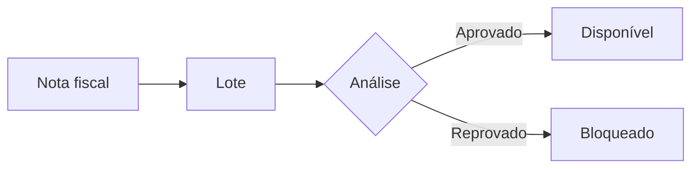

# WMarkdownView

Leitor de markdown rico (markdown-it + DOMPurify) com o vocabulário de documentação do produto:
alertas (`> [!DICA]` estilo GitHub e `::: dica` estilo VitePress, com apelidos em pt-BR e inglês),
passos, cards, abas, blocos colapsáveis, notas de rodapé, glossário, figura com legenda,
código com barra de título/idioma e botão copiar (highlight.js sob demanda) e diagramas
mermaid na paleta do tema.

Emite `headings` com o índice de títulos — ligue no [WMarkdownToc](/components/w-markdown-toc)
para montar o "Nesta página".

## API

<ApiTable name="WMarkdownView" />

## Exemplo

```vue
<script setup lang="ts">
import { ref } from 'vue'
import { WMarkdownView } from '@wgalleti/primevue-components'
import type { MarkdownHeading } from '@wgalleti/primevue-components'

const documento = `## Plano de aplicação

Aplicar o tratamento em **duas etapas**.

> [!DICA]
> Confira o saldo do lote antes de agendar a máquina.

::: passos
1. Conferir o saldo de sementes do lote
2. Agendar a máquina para o talhão
3. Registrar a aplicação no portal
:::
`

const headings = ref<MarkdownHeading[]>([])
</script>

<template>
  <WMarkdownView :source="documento" @headings="headings = $event" />
</template>
```

### Diagrama mermaid

````md

````
